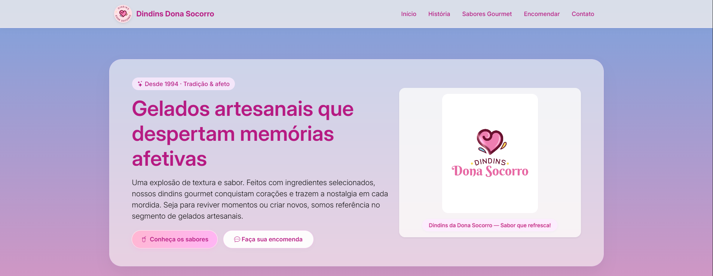
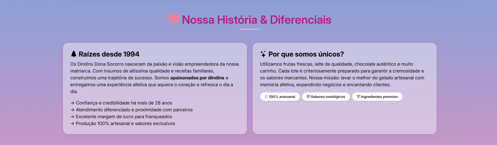
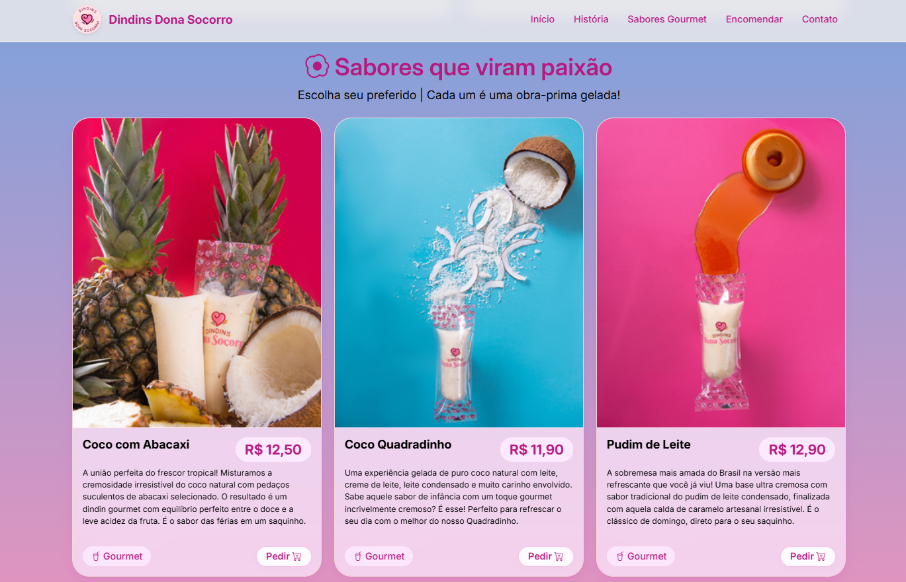
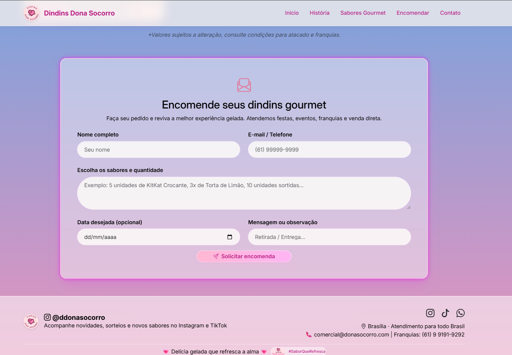

# Dindins Dona Socorro - Landing Page


## Sobre o Projeto

Landing page desenvolvida para a **Dindins Dona Socorro**, uma empresa tradicional no segmento de gelados artesanais que atua desde 1994. O site foi projetado para ampliar a divulgação da marca, fortalecer sua presença digital e atrair novos franqueados e parceiros comerciais.

---

## Screenshots

### Visão geral da página inicial


### História


### Sabores


### Formulário de Encomenda


---

## Funcionalidades

-  Design responsivo para todos os dispositivos (mobile, tablet, desktop)
-  Efeito glassmorphism (vidro fosco) nas seções principais
-  Gradiente pastel em tons de azul, rosa e pêssego
-  Cards com iluminação nas bordas e efeito hover
-  Vídeo institucional em loop na seção hero
-  Renderização dinâmica dos cards de produtos via JavaScript
-  Botão "Pedir" que adiciona automaticamente o sabor ao formulário
-  Formulário de encomendas com validação e feedback visual
-  Scroll suave na navegação entre seções
-  Links funcionais para Instagram, TikTok e WhatsApp

---

## Tecnologias Utilizadas

| Tecnologia | Descrição |
|------------|-----------|
| HTML5 | Estruturação do conteúdo |
| CSS3 | Estilização com glassmorphism, animações e responsividade |
| JavaScript | Renderização dinâmica, validação de formulário e interatividade |
| Bootstrap 5.3 | Sistema de grid, navbar responsiva e utilitários |
| Bootstrap Icons | Ícones vetoriais |
| Google Fonts | Fonte Inter |

---

## Sabores Disponíveis

| Sabor | Preço |
|-------|-------|
| Coco com Abacaxi | R$ 12,50 |
| Coco Quadradinho | R$ 11,90 |
| Pudim de Leite | R$ 12,90 |
| Mousse de Maracujá | R$ 13,90 |
| Oreo Clássico | R$ 13,90 |
| KitKat Crocante | R$ 14,90 |
| Mousse de Limão | R$ 12,90 |
| Banoffee | R$ 12,90 |
| Ninho com Nutella | R$ 16,90 |
| Mousse de Morango | R$ 13,50 |

---

## Como Executar

1. Clone o repositório:
   ```bash
   git clone https://github.com/FaculdadeJV/Dindins_DonaSocorro.git

---

  ## Autor
- Jonathan Arsego Lêla
- RA: 22408629
- Engenharia da Computação - CEUB
